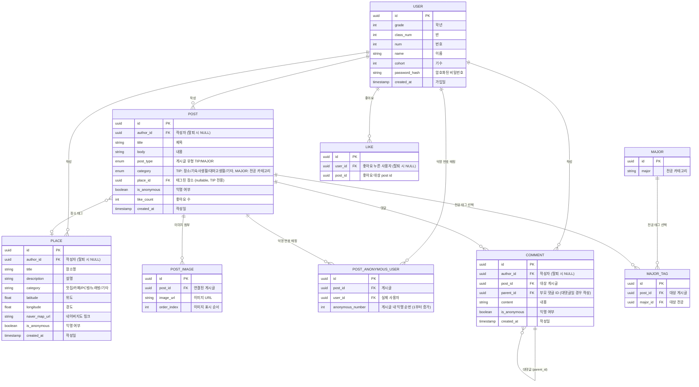

```mermaid
erDiagram
    %% 사용자 계정
    %% 로그인 시, 학년 반 번호 확인 후 변경시 update..
    USER {
        uuid id PK
        int grade "학년"
        int class_num "반"
        int num "번호"
        string name "이름" 
        int cohort "기수"
        string password_hash "암호화된 비밀번호"
        timestamp created_at "가입일"
    }

    %% 장소 공유 (지도 핀)
    PLACE {
        uuid id PK
        uuid author_id FK "작성자 (탈퇴 시 NULL)"
        string title "장소명"
        string description "설명"
        string category "맛집/카페/PC방/노래방/기타"
        float latitude "위도"
        float longitude "경도"
        string naver_map_url "네이버지도 링크"
        boolean is_anonymous "익명 여부"
        timestamp created_at "작성일"
    }

    %% 통합 게시글 - 꿀팁(TIP)과 전공(MAJOR) 게시글을 단일 테이블로 관리
    POST {
        uuid id PK
        uuid author_id FK "작성자 (탈퇴 시 NULL)"
        string title "제목"
        string body "내용"
        enum post_type "게시글 유형 TIP/MAJOR"
        enum category "TIP: 장소/기숙사생활/대마고생활/기타, MAJOR: 전공 카테고리"
        uuid place_id FK "태그된 장소 (nullable, TIP 전용)"
        boolean is_anonymous "익명 여부"
        int like_count "좋아요 수"
        timestamp created_at "작성일"
    }

    %% 게시글 첨부 이미지 - 순서 보장을 위해 order_index 관리
    POST_IMAGE {
        uuid id PK
        uuid post_id FK "연결된 게시글"
        string image_url "이미지 URL"
        int order_index "이미지 표시 순서"
    }

    %% 게시글 내 익명 번호 매핑 - (post_id, user_id) unique 제약 필요
    %% 익명 작성자가 같은 게시글에 댓글을 달아도 동일한 익명 번호 유지
    POST_ANONYMOUS_USER {
        uuid id PK
        uuid post_id FK "게시글"
        uuid user_id FK "실제 사용자"
        int anonymous_number "게시글 내 익명 순번 (1부터 증가)"
    }

    %% 댓글 / 대댓글 - parent_id가 NULL이면 댓글, 값이 있으면 대댓글
    COMMENT {
        uuid id PK
        uuid author_id FK "작성자 (탈퇴 시 NULL)"
        uuid post_id FK "대상 게시글"
        uuid parent_id FK "부모 댓글 ID (대댓글일 경우 작성)"
        string content "내용"
        boolean is_anonymous "익명 여부"
        timestamp created_at "작성일"
    }
    
    %% 전공 카테고리
    MAJOR {
        uuid id PK
        string major "전공 카테고리"
    }
    
    %% 전공 카테고리
    MAJOR_TAG {
        uuid id PK
        uuid post_id FK "대상 게시글"
        uuid major_id FK "대상 전공"
    }

    %% 좋아요 - 게시글/댓글 공통, target_type으로 대상 구분
    LIKE {
        uuid id PK
        uuid user_id FK "좋아요 누른 사용자 (탈퇴 시 NULL)"
        uuid post_id "좋아요 대상 post id"
    }

    USER ||--o{ PLACE : "작성"
    USER ||--o{ POST : "작성"
    USER ||--o{ COMMENT : "작성"
    USER ||--o{ LIKE : "좋아요"
    USER ||--o{ POST_ANONYMOUS_USER : "익명 번호 매핑"

    POST }o--o| PLACE : "장소 태그"
    POST ||--o{ POST_IMAGE : "이미지 첨부"
    POST ||--o{ COMMENT : "댓글"
    POST ||--o{ POST_ANONYMOUS_USER : "익명 번호 매핑"

    COMMENT ||--o{ COMMENT : "대댓글 (parent_id)"
    
    MAJOR ||--o{ MAJOR_TAG : "전공 태그 선택"
    POST ||--o{ MAJOR_TAG : "전공 태그 선택"
```
